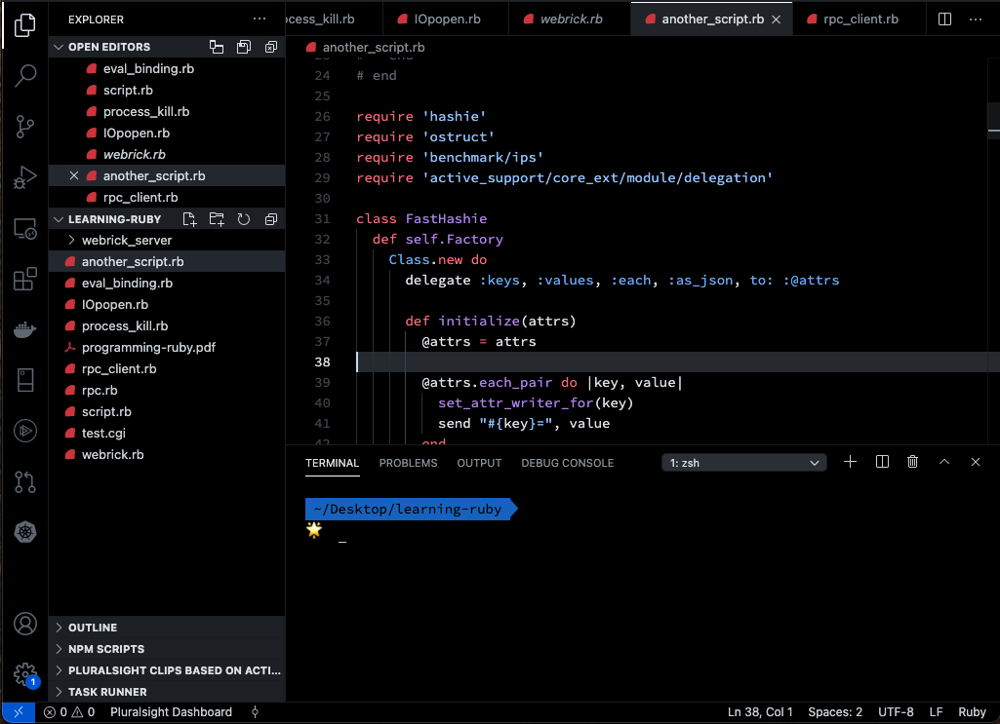

  

# True Dark Github Theme
 

 

This is a port of the official [Github Theme](https://marketplace.visualstudio.com/items?itemName=GitHub.github-vscode-theme) by Github. But it has been customized to use true black backgrounds.

## Installation

1. Go to []
